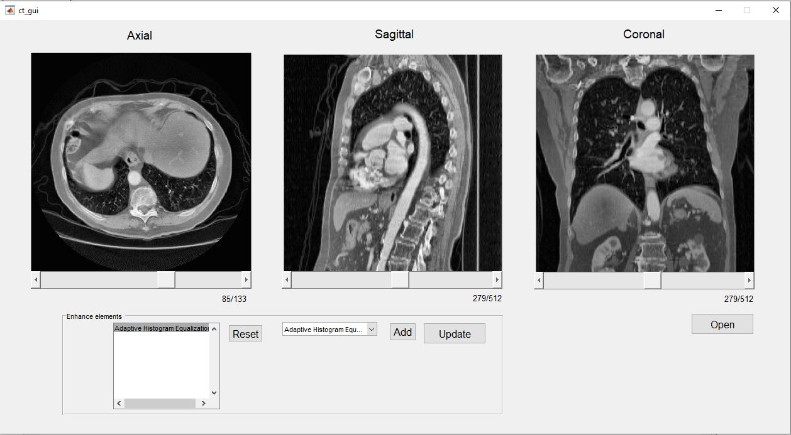

# DICOM_Reader_MATLAB
Digital Imaging and Communications in Medicine (DICOM) format file reader in MATLAB.

CT images usually are in the DICOM file format (.dcm) contain multiple 16-bit grayscale image in 3 sections.

